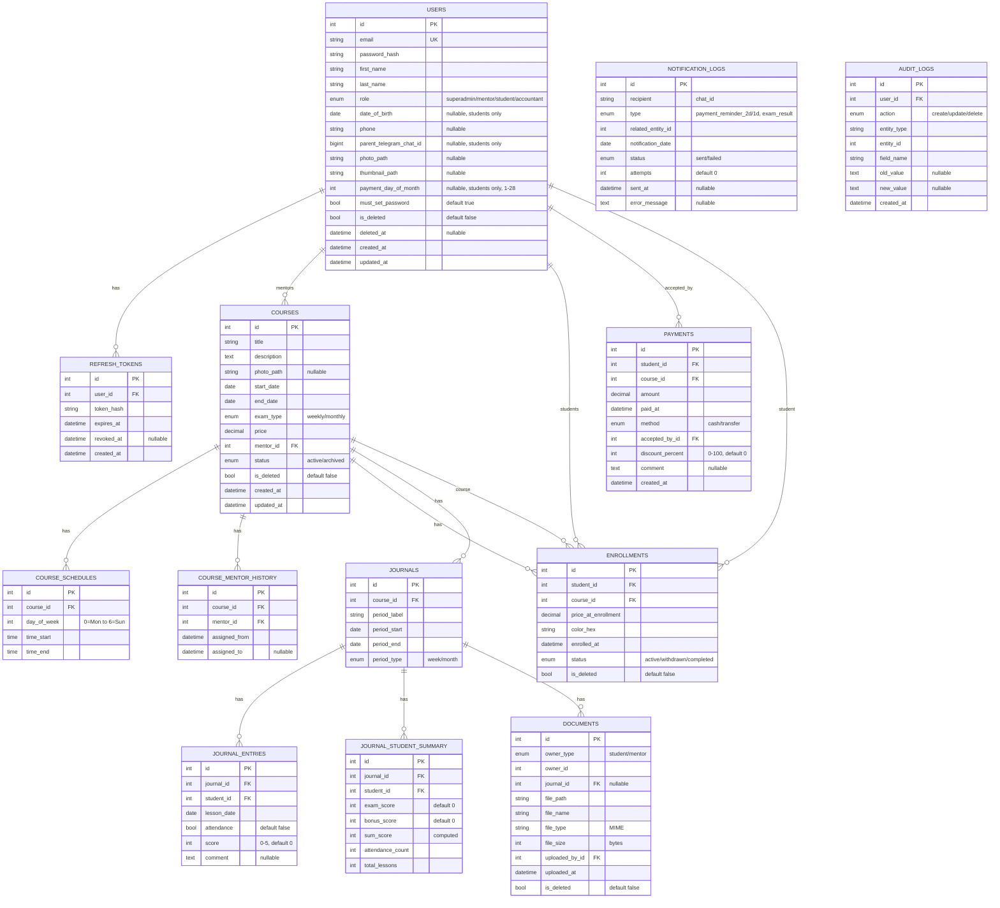
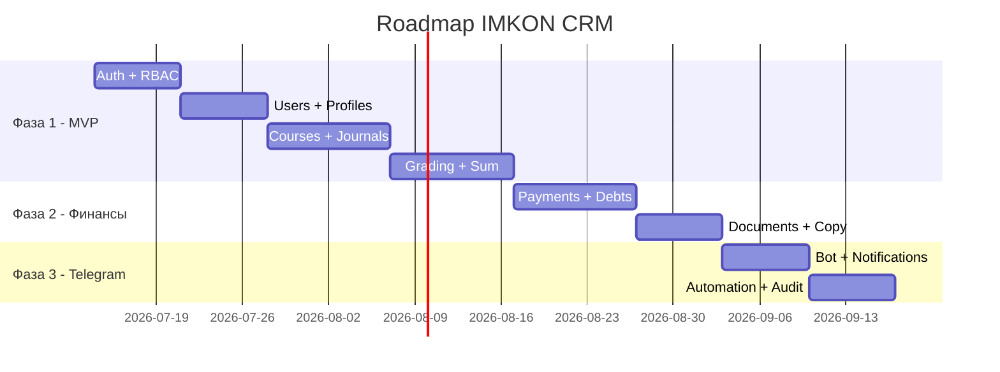

# PRD: CRM-система образовательного центра «ИМКОН»

**Версия документа:** 1.0
**Дата:** 2026-07-11
**Автор:** Product Manager (AI-assisted)
**Статус:** Draft — ожидает Review

---

## 1. Обзор проекта и цели

### 1.1. Описание продукта

CRM-система для образовательного центра «ИМКОН» — серверное приложение (backend API), управляющее полным жизненным циклом обучения: от зачисления студентов и ведения журналов успеваемости до финансового учёта и автоматизированных уведомлений родителям через Telegram.

### 1.2. Проблема, которую решает продукт

| Проблема | Как решает CRM |
|---|---|
| Ручной учёт оценок и посещаемости в тетрадях / таблицах | Цифровой журнал с автоматическим расчётом итогов |
| Отсутствие контроля оплат и задолженностей | Модуль бухгалтерии с аналитикой долгов |
| Родители не в курсе прогресса ребёнка | Автоматические Telegram-уведомления |
| Нет единой базы студентов, менторов, курсов | Централизованная система с ролевым доступом |
| Нет истории: кто вёл курс, как менялись оценки | Audit log и история изменений |

### 1.3. Ключевые цели

1. **Автоматизация учебного процесса:** журналы генерируются автоматически, оценки агрегируются без ручного подсчёта.
2. **Прозрачность финансов:** каждый платёж фиксируется, задолженности отслеживаются, уведомления отправляются автоматически.
3. **Безопасность и аудируемость:** ролевой доступ, JWT-аутентификация, audit log критичных операций.
4. **Масштабируемость:** архитектура готова к росту (абстракция хранилища, async, очереди задач).

### 1.4. Технологический стек

| Компонент | Технология |
|---|---|
| Backend framework | FastAPI (async) |
| ORM | SQLAlchemy 2.0 (async, AsyncSession) |
| Миграции | Alembic |
| Валидация / схемы | Pydantic v2 |
| База данных | PostgreSQL |
| Кэш / брокер задач | Redis |
| Фоновые задачи / cron | Arq (async task queue поверх Redis) |
| Telegram-бот | aiogram (async, webhook) |
| Хранилище файлов | Локальная ФС → S3 (через абстракцию `StorageService`) |
| Обработка изображений | Pillow |
| Аутентификация | JWT (access + refresh токены) |
| Тестирование | pytest, pytest-asyncio, httpx (AsyncClient) |
| API версионирование | Префикс `/api/v1/...` |
| Python-окружение | Conda (базовое окружение `base`) |

### 1.5. Архитектурные принципы

- **Чистая слоистая архитектура:** API layer → Service layer → Repository layer → Models.
- **Bounded contexts:** auth, users, courses, journals, finance, documents, notifications, telegram_bot.
- **SOLID:**
  - Repository-интерфейсы (абстрактные классы / протоколы) + конкретные реализации на SQLAlchemy.
  - Сервисы зависят от абстракций репозиториев (Dependency Inversion), внедрение через `FastAPI Depends`.
  - Single Responsibility для каждого сервиса.
- **Минимум комментариев** — только для неочевидной логики (расчёт Sum, cron-уведомления).
- **Побочные эффекты** (Telegram, thumbnail) — через сервисы, не внутри моделей.

---

## 2. Целевая аудитория

| Роль | Описание | Ключевые потребности |
|---|---|---|
| **SuperAdmin** (Администрация центра) | Управляет всей системой. Единственный, кто создаёт пользователей | Полный контроль, аналитика, управление курсами |
| **Mentor** (Преподаватель) | Ведёт занятия, выставляет оценки | Удобный журнал, быстрый ввод оценок |
| **Student** (Студент) | Учится на курсах | Просмотр своих оценок, документов, профиля |
| **Accountant** (Бухгалтер) | Ведёт финансовый учёт | Платежи, задолженности, финансовая аналитика |
| **Родители** (через Telegram) | Получают информацию о ребёнке | Уведомления об оплате и результатах экзаменов |

---

## 3. Матрица приоритизации функций

| # | Функция | Приоритет | Обоснование |
|---|---|---|---|
| F-01 | JWT-аутентификация (access + refresh) | Must-have (MVP) | Базовая безопасность, без неё ничего не работает |
| F-02 | Регистрация через 6-значный код (email) | Must-have (MVP) | Единственный механизм первого входа |
| F-03 | Установка пароля при первом входе | Must-have (MVP) | Безопасность, пользователь должен задать свой пароль |
| F-04 | Сброс/восстановление пароля | Must-have (MVP) | Критично для UX, пользователи забывают пароли |
| F-05 | Ролевая модель доступа (RBAC) | Must-have (MVP) | 4 роли с разными правами — ядро безопасности |
| F-06 | Управление пользователями (CRUD) | Must-have (MVP) | SuperAdmin создаёт менторов/студентов/бухгалтеров |
| F-07 | Профиль студента (детальный) | Must-have (MVP) | Центральная сущность системы |
| F-08 | Профиль ментора | Must-have (MVP) | Привязка к курсам, базовая аналитика |
| F-09 | Управление курсами (CRUD) | Must-have (MVP) | Ядро учебного процесса |
| F-10 | Расписание курса (CourseSchedule) | Must-have (MVP) | Определяет дни занятий и генерацию журналов |
| F-11 | Автоматическая генерация журналов | Must-have (MVP) | Ключевая автоматизация, устраняет ручную работу |
| F-12 | Журнал оценок (посещаемость, баллы, комментарии) | Must-have (MVP) | Ядро учебного процесса |
| F-13 | Расчёт Sum (итоговый балл) | Must-have (MVP) | Автоматический расчёт — основная ценность журнала |
| F-14 | Экзамены и бонусы в журнале | Must-have (MVP) | Часть формулы Sum, обязательная бизнес-логика |
| F-15 | Зачисление студентов на курс (enrollment) | Must-have (MVP) | Связывает студентов с курсами и ценой |
| F-16 | Финансы: регистрация платежей | Must-have (MVP) | Критично для бизнеса центра |
| F-17 | Финансы: расчёт задолженности | Must-have (MVP) | Контроль оплат — основная потребность бухгалтерии |
| F-18 | Скидки на платежи | Should-have | Часто используется, но не блокирует MVP |
| F-19 | Индивидуальная дата оплаты (PaymentSchedule) | Should-have | Важно для уведомлений, но оплату можно фиксировать и без |
| F-20 | Финансовая аналитика (агрегаты) | Should-have | Ценно для бухгалтерии, но базовый список долгов уже в MVP |
| F-21 | Документы в журнале (загрузка файлов) | Should-have | Полезно, но журнал работает и без документов |
| F-22 | Документы ментора | Should-have | Хранение договоров/сертификатов |
| F-23 | Копирование курса (с переносом студентов) | Should-have | Удобство, но можно создать курс вручную |
| F-24 | История ментора курса (CourseMentorHistory) | Should-have | Аналитика, не блокирует основной процесс |
| F-25 | График динамики (данные для фронтенда) | Should-have | Визуализация прогресса, но требует фронтенда |
| F-26 | Автоматическая архивация курсов (cron) | Should-have | Автоматизация статуса, можно вручную на старте |
| F-27 | Telegram-бот: уведомления об оплате | Should-have | Высокая ценность, но требует отдельного сервиса |
| F-28 | Telegram-бот: результаты экзаменов | Should-have | Высокая ценность, связано с F-27 |
| F-29 | Хранилище файлов (абстракция StorageService) | Must-have (MVP) | Инфраструктурная необходимость для документов |
| F-30 | Генерация thumbnail (Pillow) | Could-have | Улучшение UX, но можно отдавать оригинал |
| F-31 | Audit Log (журнал аудита) | Should-have | Важно для прозрачности, но не блокирует MVP |
| F-32 | Soft Delete (мягкое удаление) | Must-have (MVP) | Без soft delete ломаются исторические связи |
| F-33 | Пагинация и фильтрация | Must-have (MVP) | Базовый UX для списков |
| F-34 | Rate limiting (ограничение попыток ввода кода) | Must-have (MVP) | Защита от перебора, критично для безопасности |
| F-35 | Идемпотентность уведомлений | Should-have | Связано с F-27/F-28, предотвращает дубли |
| F-36 | Привязка родителя к Telegram-боту | Should-have | Обязательно для работы уведомлений |
| F-37 | Аналитика ментора | Could-have | Полезно, но не критично |
| F-38 | Тестирование (unit + integration) | Must-have (MVP) | Пишется параллельно с каждым модулем |

---

## 4. Основные функции и функциональность

---

### F-01: JWT-аутентификация (access + refresh токены)

**Приоритет:** Must-have (MVP)

**User story:** Как пользователь системы, я хочу безопасно входить в систему и поддерживать сессию, чтобы мои данные были защищены, а сессия не прерывалась каждые несколько минут.

**Как это работает (пошагово):**
1. Пользователь отправляет запрос на аутентификацию (email + пароль) на `POST /api/v1/auth/login`.
2. Сервер проверяет credentials, при успехе генерирует пару токенов:
   - **Access token** (JWT, TTL 15–30 мин) — содержит `user_id`, `role`, `exp`.
   - **Refresh token** (JWT, TTL 30 дней) — хэш сохраняется в таблице `refresh_tokens`.
3. Access token используется в заголовке `Authorization: Bearer <token>` для каждого защищённого запроса.
4. Когда access token истекает, клиент отправляет refresh token на `POST /api/v1/auth/refresh`.
5. Сервер проверяет refresh token (не истёк, не отозван), генерирует новую пару токенов, старый refresh token отзывается (rotation).
6. При смене пароля все refresh-токены пользователя отзываются (revoke all sessions).

**Что видит пользователь / основные экраны:**
- Экран логина (email + пароль).
- Автоматическое обновление сессии (прозрачно для пользователя).

**Граничные случаи и обработка ошибок:**
- Истёкший access token → 401 Unauthorized, клиент должен вызвать refresh.
- Истёкший/отозванный refresh token → 401 Unauthorized, требуется повторный логин.
- Неверные credentials → 401 + общее сообщение «Invalid email or password» (без раскрытия, что именно неверно).
- Параллельный refresh одного токена из двух вкладок → только первый запрос успешен (token rotation), второй получает 401.

**Acceptance criteria:**
- [ ] Access token содержит `user_id`, `role`, `exp` в payload.
- [ ] Refresh token хранится хэшированным (bcrypt/argon2) в таблице `refresh_tokens`.
- [ ] При смене пароля все существующие refresh-токены пользователя отзываются.
- [ ] Refresh token rotation: при каждом обновлении старый refresh token отзывается.
- [ ] 401 возвращается для любых невалидных/истёкших токенов.

**Technical considerations:**
- Библиотека: `python-jose` или `PyJWT` для генерации/проверки JWT.
- Хэширование: `passlib[bcrypt]` для паролей и refresh-токенов.
- Таблица `refresh_tokens`: `id`, `user_id` (FK), `token_hash`, `expires_at`, `revoked_at`, `created_at`.
- Access token НЕ хранится в БД — проверяется только подписью.
- Refresh token связан с конкретным устройством/сессией опционально (можно расширить позже).

---

### F-02: Регистрация через 6-значный одноразовый код

**Приоритет:** Must-have (MVP)

**User story:** Как новый пользователь (Ментор/Студент/Бухгалтер), я хочу получить код подтверждения на email после того, как SuperAdmin создал мою учётную запись, чтобы я мог безопасно войти в систему впервые.

**Как это работает (пошагово):**
1. SuperAdmin создаёт пользователя через `POST /api/v1/users/` (указывает email, роль, базовые поля).
2. Система генерирует случайный 6-значный цифровой код.
3. Код сохраняется в Redis с ключом `auth:code:{email}`, TTL = 10 минут.
4. Код отправляется на email пользователя (через email-сервис).
5. Пользователь переходит на экран «Первый вход», вводит email и код.
6. Система проверяет код из Redis, при совпадении — верифицирует аккаунт.
7. Код удаляется из Redis после успешной верификации.

**Что видит пользователь / основные экраны:**
- Email с 6-значным кодом и инструкцией.
- Экран ввода кода на фронтенде.

**Граничные случаи и обработка ошибок:**
- Код истёк (TTL > 10 мин) → сообщение «Code expired, request a new one».
- Неверный код → счётчик попыток (см. F-34, rate limiting), сообщение «Invalid code».
- Повторная отправка кода → старый код в Redis перезаписывается новым.
- Email не найден в системе → общее сообщение без раскрытия, зарегистрирован ли email.

**Acceptance criteria:**
- [ ] Код — строго 6 цифр, криптографически случайный (`secrets.randbelow`).
- [ ] Код хранится в Redis с TTL = 10 минут.
- [ ] Код одноразовый — после успешной верификации удаляется из Redis.
- [ ] При повторном запросе кода старый перезаписывается.
- [ ] Email отправляется асинхронно (через Arq-задачу или фоновый таск).

**Technical considerations:**
- Redis key pattern: `auth:code:{email}` → value: `{"code": "123456", "attempts": 0}`.
- Email-сервис: SMTP или SendGrid/Mailgun — выбор фиксируется при разработке.
- Код генерируется через `secrets.randbelow(900000) + 100000` для гарантии 6 цифр.

---

### F-03: Установка пароля при первом входе

**Приоритет:** Must-have (MVP)

**User story:** Как новый пользователь, после подтверждения кода я хочу задать свой постоянный пароль, чтобы в дальнейшем входить по email + паролю.

**Как это работает (пошагово):**
1. После успешной верификации кода (F-02) пользователь получает временный access token с ограниченным scope (`must_set_password = true`).
2. Клиент перенаправляет на экран «Установка пароля».
3. Пользователь вводит новый пароль (дважды для подтверждения).
4. Запрос `POST /api/v1/auth/set-password` с временным токеном и новым паролем.
5. Система хэширует пароль, сохраняет в `users.password_hash`, снимает флаг `must_set_password`.
6. Выдаёт полноценную пару access + refresh токенов.

**Что видит пользователь / основные экраны:**
- Экран «Создайте пароль» с двумя полями ввода.
- Индикатор сложности пароля (фронтенд, вне scope бэкенда).

**Граничные случаи и обработка ошибок:**
- Пароли не совпадают → 400, «Passwords do not match» (валидация на фронтенде + бэкенде).
- Пароль слишком слабый → 400, с указанием минимальных требований (≥ 8 символов, минимум 1 цифра).
- Попытка использовать временный токен для других эндпоинтов → 403.

**Acceptance criteria:**
- [ ] Временный токен с `must_set_password` не даёт доступ к основным эндпоинтам.
- [ ] Минимальные требования к паролю: ≥ 8 символов, минимум 1 цифра.
- [ ] Пароль хэшируется через bcrypt с cost factor ≥ 12.
- [ ] После установки пароля `must_set_password` сбрасывается на `False`.
- [ ] Выдаётся полноценная пара access + refresh токенов.

**Technical considerations:**
- Поле `must_set_password: bool` в таблице `users` (default `True` при создании).
- Middleware проверяет `must_set_password` и блокирует доступ ко всем эндпоинтам, кроме `/auth/set-password`.

---

### F-04: Сброс / восстановление пароля

**Приоритет:** Must-have (MVP)

**User story:** Как пользователь, забывший пароль, я хочу восстановить доступ через email-код, чтобы не потерять аккаунт.

**Как это работает (пошагово):**
1. Пользователь нажимает «Забыл пароль» и вводит email.
2. Запрос `POST /api/v1/auth/password-reset/request` → система генерирует 6-значный код (аналогично F-02).
3. Код сохраняется в Redis: `auth:reset:{email}`, TTL = 10 минут.
4. Код отправляется на email.
5. Пользователь вводит код на экране подтверждения: `POST /api/v1/auth/password-reset/verify`.
6. При совпадении кода система выдаёт одноразовый `reset_token` (короткий TTL, 5 мин).
7. Пользователь вводит новый пароль: `POST /api/v1/auth/password-reset/confirm` с `reset_token` и новым паролем.
8. Пароль обновляется, все существующие refresh-токены отзываются, выдаётся новая пара токенов.

**Что видит пользователь / основные экраны:**
- Экран «Введите email».
- Экран «Введите код из письма».
- Экран «Новый пароль».

**Граничные случаи и обработка ошибок:**
- Email не зарегистрирован → 200 OK (без раскрытия факта регистрации, но код не отправляется).
- Код истёк → «Code expired».
- Reset token истёк → «Token expired, start over».
- Новый пароль совпадает со старым → допустимо (не блокировать).

**Acceptance criteria:**
- [ ] Трёхэтапный процесс: request → verify → confirm.
- [ ] Все существующие refresh-токены отзываются при смене пароля.
- [ ] Reset token одноразовый и short-lived (5 мин).
- [ ] Эндпоинт request возвращает 200 независимо от наличия email в БД (security).
- [ ] Rate limiting применяется к request-эндпоинту (см. F-34).

**Technical considerations:**
- Redis key: `auth:reset:{email}` → `{"code": "654321", "attempts": 0}`.
- Reset token: обычный JWT с claim `type: "password_reset"`, TTL 5 мин.
- Зависимость от F-01 (отзыв refresh-токенов) и F-34 (rate limiting).

---

### F-05: Ролевая модель доступа (RBAC)

**Приоритет:** Must-have (MVP)

**User story:** Как SuperAdmin, я хочу, чтобы каждый пользователь имел доступ только к разрешённым ему разделам, чтобы обеспечить безопасность данных.

**Как это работает (пошагово):**
1. Каждый пользователь имеет одну из 4 ролей: `superadmin`, `mentor`, `student`, `accountant`.
2. На каждом защищённом эндпоинте FastAPI dependency проверяет роль из JWT-токена.
3. Для ресурсов, привязанных к владельцу (журналы ментора, профиль студента), дополнительно проверяется ownership.
4. При несовпадении роли/владельца — 403 Forbidden.

**Что видит пользователь / основные экраны:**
- Интерфейс отображает только доступные разделы (определяется фронтендом на основе роли из токена).

**Граничные случаи и обработка ошибок:**
- Ментор пытается изменить журнал чужого курса → 403.
- Студент пытается просмотреть профиль другого студента → 403.
- Бухгалтер пытается открыть журнал → 403.
- Запрос с невалидной ролью в токене → 403.

**Acceptance criteria:**
- [ ] Реализованы FastAPI dependencies: `require_role(...)`, `require_superadmin`, `require_course_owner(...)`.
- [ ] Ментор может менять только журналы курсов, где `course.mentor_id == current_user.id`.
- [ ] Студент видит только свои записи (`student_id == current_user.id`).
- [ ] Бухгалтер имеет доступ только к эндпоинтам `/api/v1/finance/**`.
- [ ] SuperAdmin имеет полный доступ ко всем эндпоинтам.
- [ ] Все проверки покрыты интеграционными тестами (попытки доступа к чужим ресурсам).

**Technical considerations:**
- Матрица доступа:

| Ресурс | SuperAdmin | Mentor | Student | Accountant |
|---|:---:|:---:|:---:|:---:|
| Управление пользователями | CRUD | — | — | — |
| Курсы | CRUD | Read (свои) | Read (свои) | — |
| Журналы | CRUD* | Update (свои) | Read (свои) | — |
| Финансы | CRUD | — | — | CRUD |
| Документы студента | CRUD | Read | Read (свои) | — |
| Документы ментора | CRUD | Read (свои) | — | — |

*\* Включая архивные курсы — единственная роль с таким правом.*

- Реализация: кастомные FastAPI dependencies в `app/core/deps.py`.
- Ownership-проверки выполняются в service layer, не в middleware.

---

### F-06: Управление пользователями (CRUD)

**Приоритет:** Must-have (MVP)

**User story:** Как SuperAdmin, я хочу создавать, просматривать, редактировать и деактивировать учётные записи менторов, студентов и бухгалтеров, чтобы управлять кадровым составом центра.

**Как это работает (пошагово):**
1. SuperAdmin заполняет форму создания пользователя: email, имя, фамилия, роль, доп. поля (для студента — дата рождения, телефон, Telegram родителя).
2. `POST /api/v1/users/` → система создаёт запись в `users`, генерирует 6-значный код, отправляет на email.
3. Просмотр списка: `GET /api/v1/students/`, `GET /api/v1/mentors/` — с пагинацией и фильтрами.
4. Редактирование: `PATCH /api/v1/users/{id}` — SuperAdmin может менять любые поля, кроме `role`.
5. Деактивация (soft delete): `DELETE /api/v1/users/{id}` → устанавливает `is_deleted = True`, не удаляет физически.

**Что видит пользователь / основные экраны:**
- Список пользователей (по ролям) с поиском и фильтрацией.
- Форма создания / редактирования пользователя.
- Кнопка «Деактивировать» вместо «Удалить».

**Граничные случаи и обработка ошибок:**
- Попытка создать пользователя с уже занятым email → 409 Conflict.
- Попытка удалить SuperAdmin → 403 (SuperAdmin не может быть деактивирован через API).
- Деактивированный пользователь пытается войти → 401 «Account deactivated».
- Изменение email пользователя → требует повторной верификации (новый код).

**Acceptance criteria:**
- [ ] SuperAdmin может создавать пользователей с ролями: `mentor`, `student`, `accountant`.
- [ ] Email уникален в рамках всей таблицы `users` (constraint).
- [ ] При создании автоматически генерируется и отправляется 6-значный код.
- [ ] Soft delete: `is_deleted = True`, пользователь не может войти, но записи в журналах/платежах сохраняются.
- [ ] Списки пользователей поддерживают пагинацию и поиск по имени/фамилии/email.
- [ ] Только SuperAdmin имеет доступ к CRUD-операциям.

**Technical considerations:**
- Единая таблица `users` с полем `role: Enum('superadmin', 'mentor', 'student', 'accountant')`.
- Поля, специфичные для студента (`date_of_birth`, `parent_telegram_chat_id`), nullable для других ролей.
- Индексы: уникальный на `email`, составной на `(role, is_deleted)` для фильтрации.
- При деактивации — отзыв всех refresh-токенов пользователя.

---

### F-07: Профиль студента (детальный)

**Приоритет:** Must-have (MVP)

**User story:** Как SuperAdmin / Ментор, я хочу видеть полный профиль студента с агрегированной статистикой, чтобы оценивать его прогресс. Как Студент, я хочу видеть свой профиль с оценками и курсами.

**Как это работает (пошагово):**
1. Запрос `GET /api/v1/students/{id}/profile` возвращает:
   - Персональные данные (имя, фамилия, дата рождения, телефон, email, фото + thumbnail).
   - Список курсов: текущий активный + завершённые (архивные).
   - По каждому курсу — средний балл (Average Sum) по всем журналам.
   - Общий средний балл по всем курсам за всё время.
   - Количество пропущенных дней (агрегировано по всем журналам).
   - Общая успеваемость (% посещаемости + средний Sum).
   - Список документов (агрегированный по всем журналам).
2. Финансовая информация (баланс / долг) — отдельный эндпоинт, доступный только SuperAdmin и Accountant.
3. Студент видит свой профиль через `GET /api/v1/students/me/profile` — без финансовой информации.

**Что видит пользователь / основные экраны:**
- Карточка студента с фото и персональными данными.
- Вкладки: «Курсы», «Успеваемость», «Документы».
- Агрегированные показатели на главном экране профиля.

**Граничные случаи и обработка ошибок:**
- Студент без курсов → пустой список, средний балл = N/A.
- Студент с деактивированным аккаунтом → профиль доступен для просмотра (для истории), но помечен как «Архивный».
- Фото не загружено → placeholder/дефолтный аватар (определяется фронтендом).

**Acceptance criteria:**
- [ ] Эндпоинт возвращает все персональные поля + агрегированную статистику.
- [ ] Средний балл рассчитывается на лету (не хранится отдельно).
- [ ] Количество пропусков = count дней с `attendance = false` по всем журналам.
- [ ] Студент через `GET /me/profile` видит только свои данные без финансов.
- [ ] Ментор видит профили только тех студентов, которые зачислены на его курсы.

**Technical considerations:**
- Агрегированные данные рассчитываются SQL-запросами (JOIN enrollment → journal → journal_entry).
- Для производительности: рассмотреть кэширование профиля в Redis с инвалидацией при изменении оценок/зачислений.
- Поля студента: `first_name`, `last_name`, `date_of_birth`, `phone`, `email`, `parent_telegram_chat_id`, `photo_path`, `thumbnail_path`, `is_deleted`.

---

### F-08: Профиль ментора

**Приоритет:** Must-have (MVP)

**User story:** Как SuperAdmin, я хочу видеть профиль ментора с его курсами и базовой аналитикой. Как Ментор, я хочу видеть свой профиль и список своих групп.

**Как это работает (пошагово):**
1. `GET /api/v1/mentors/{id}/profile` → персональные данные + аналитика.
2. `GET /api/v1/mentors/` → список менторов с пагинацией.
3. Раздел «Документы ментора» (договор, дипломы, сертификаты):
   - Загрузка/удаление/изменение — только SuperAdmin.
   - Ментор может только просматривать свои документы.

**Что видит пользователь / основные экраны:**
- Карточка ментора: имя, фамилия, email, телефон, фото.
- Аналитика: количество активных курсов, средний балл студентов, общее количество студентов.
- Список документов.

**Граничные случаи и обработка ошибок:**
- Ментор без курсов → аналитика = 0/N/A.
- Ментор удалён (soft delete) → профиль доступен для просмотра в истории.

**Acceptance criteria:**
- [ ] Список менторов поддерживает пагинацию (`limit`/`offset`) и поиск по имени.
- [ ] Аналитика ментора: кол-во активных курсов, средний балл студентов, общее кол-во студентов.
- [ ] Документы ментора: CRUD для SuperAdmin, Read-only для ментора.
- [ ] Ментор видит только свой профиль через `GET /api/v1/mentors/me/profile`.

**Technical considerations:**
- Поля: `first_name`, `last_name`, `email`, `phone`, `photo_path` (nullable), `is_deleted`.
- Аналитика рассчитывается SQL-агрегатами: `COUNT(courses WHERE status=active)`, `AVG(sum) по всем journal_entry`, `COUNT(DISTINCT student_id) по enrollment`.
- Документы ментора: та же таблица `documents` с `owner_type = 'mentor'`, `journal_id = NULL`.

---

### F-09: Управление курсами (CRUD)

**Приоритет:** Must-have (MVP)

**User story:** Как SuperAdmin, я хочу создавать, редактировать и архивировать курсы, чтобы организовывать учебный процесс.

**Как это работает (пошагово):**
1. SuperAdmin заполняет форму создания курса: название, описание, фото, даты начала/окончания, расписание, тип экзамена (weekly/monthly), цена, ментор.
2. `POST /api/v1/courses/` → создание курса + автоматическая генерация журналов (F-11).
3. `GET /api/v1/courses/` → список курсов с пагинацией и фильтрами (статус, ментор, дата).
4. `PATCH /api/v1/courses/{id}` → редактирование (некоторых полей).
5. Статус `active` → `archived` — автоматически по дате или вручную SuperAdmin.

**Что видит пользователь / основные экраны:**
- Список курсов (карточки: фото, название, ментор, статус, количество студентов).
- Форма создания / редактирования курса.
- Детальная страница курса.

**Граничные случаи и обработка ошибок:**
- Дата начала > дата окончания → 400 Validation Error.
- Курс без расписания → 400, расписание обязательно.
- Ментор не найден → 404.
- Редактирование дат после генерации журналов → запрещено (или требует пересоздания журналов — уточнить при разработке, рекомендация: запретить изменение дат для курсов с уже созданными журналами).
- При создании нового курса цена предзаполняется значением последнего созданного курса (convenience, фронтенд).

**Acceptance criteria:**
- [ ] Курс создаётся с полным набором полей: название, описание, фото, даты, расписание, тип экзамена, цена, ментор.
- [ ] При создании автоматически генерируются журналы (F-11).
- [ ] Цена фиксируется при создании и не меняется после (для зачисленных студентов).
- [ ] Список курсов поддерживает пагинацию и фильтрацию по статусу.
- [ ] Статусы: `active`, `archived`.
- [ ] Soft delete: курс не удаляется физически.

**Technical considerations:**
- Таблица `courses`: `id`, `title`, `description`, `photo_path`, `start_date`, `end_date`, `exam_type` (enum: weekly/monthly), `price` (Decimal), `mentor_id` (FK → users), `status` (enum: active/archived), `is_deleted`, `created_at`, `updated_at`.
- Индексы: на `status`, `mentor_id`, `start_date`.
- При создании курса — транзакция: `INSERT course` + `INSERT course_schedules` + генерация журналов (F-11).

---

### F-10: Расписание курса (CourseSchedule)

**Приоритет:** Must-have (MVP)

**User story:** Как SuperAdmin, я хочу задать индивидуальное расписание для каждого курса (дни недели и время), чтобы система знала, когда проходят занятия.

**Как это работает (пошагово):**
1. При создании курса SuperAdmin указывает расписание: для каждого дня недели — время начала и окончания занятия.
2. Пример: Пн 18:00–20:00, Ср 17:00–19:00, Пт 18:00–20:00.
3. Расписание сохраняется как набор записей `CourseSchedule`, привязанных к курсу.
4. Расписание используется для генерации журналов (F-11) — определяет, какие дни попадают в каждый период.

**Что видит пользователь / основные экраны:**
- Форма создания курса: мультиселект дней недели, для каждого выбранного дня — поля времени начала/окончания.

**Граничные случаи и обработка ошибок:**
- Дублирование дня недели → 400 «Duplicate day of week».
- Время начала ≥ время окончания → 400 «Start time must be before end time».
- Пустое расписание (ни одного дня) → 400, минимум 1 день обязателен.

**Acceptance criteria:**
- [ ] Расписание привязано к курсу (one-to-many: course → course_schedules).
- [ ] Валидация: дни недели не дублируются.
- [ ] Валидация: `time_start < time_end`.
- [ ] Минимум 1 день в расписании.

**Technical considerations:**
- Таблица `course_schedules`: `id`, `course_id` (FK), `day_of_week` (int, 0=Monday...6=Sunday), `time_start` (Time), `time_end` (Time).
- Unique constraint: `(course_id, day_of_week)`.
- Расписание не меняется после создания курса (если нужно изменить — создать новый курс).

---

### F-11: Автоматическая генерация журналов

**Приоритет:** Must-have (MVP)

**User story:** Как SuperAdmin, я хочу, чтобы при создании курса автоматически генерировались журналы (по неделям или месяцам), чтобы не создавать их вручную.

**Как это работает (пошагово):**
1. При создании курса вызывается `JournalGenerationService.generate(course)`.
2. **Weekly:** диапазон `[start_date, end_date]` делится на недели (7 дней). Каждая неделя — отдельный `Journal` с `period_label = "Week 1"`, `period_start`, `period_end`. Последняя неделя может быть неполной.
3. **Monthly:** диапазон делится по календарным месяцам. Каждый месяц — отдельный `Journal` с `period_label = "Month 1"`, `period_start`, `period_end`.
4. Для каждого журнала определяются конкретные даты занятий (пересечение дат периода и `CourseSchedule`) — это даты, по которым будут ячейки в журнале.
5. Журналы сохраняются в БД как набор записей `Journal`. Конкретные ячейки (`JournalEntry`) создаются при зачислении студента.

**Что видит пользователь / основные экраны:**
- Фронтенд: выпадающий список «Week 1, Week 2, ... / Month 1, Month 2, ...» для выбора журнала.

**Граничные случаи и обработка ошибок:**
- Курс длительностью < 7 дней (weekly) → 1 неполная неделя.
- Курс с 0 днями занятий в периоде (все дни расписания не попадают) → пустой журнал (warning в логе).
- Даты начала/окончания в середине недели → первая/последняя неделя неполные — это нормальное поведение.

**Acceptance criteria:**
- [ ] При создании курса автоматически создаются журналы.
- [ ] Weekly: деление по 7 дней, последняя неделя может быть неполной.
- [ ] Monthly: деление по календарным месяцам.
- [ ] Каждый журнал имеет `period_label`, `period_start`, `period_end`, `period_type`.
- [ ] Генерация выполняется в одной транзакции с созданием курса.
- [ ] Покрыто unit-тестами: полные недели, неполные недели, кросс-месячные диапазоны.

**Technical considerations:**
- Таблица `journals`: `id`, `course_id` (FK), `period_label` (str), `period_start` (date), `period_end` (date), `period_type` (enum: week/month).
- Сервис `JournalGenerationService` — pure function, принимает `start_date`, `end_date`, `exam_type`, возвращает список объектов `Journal`.
- Даты занятий внутри журнала определяются динамически (по `CourseSchedule` + `period_start`/`period_end`) или хранятся как `lesson_dates: list[date]` — рекомендуется хранить для производительности.

---

### F-12: Журнал оценок (посещаемость, баллы, комментарии)

**Приоритет:** Must-have (MVP)

**User story:** Как Ментор, я хочу выставлять посещаемость, баллы за ДЗ и комментарии по каждому дню занятий для каждого студента, чтобы вести учёт успеваемости.

**Как это работает (пошагово):**
1. Ментор выбирает курс → выбирает журнал (период) из выпадающего списка.
2. Видит таблицу: строки = студенты, колонки = дни занятий + Bonus + Exam + Sum.
3. Для каждой ячейки (студент × день) выставляет:
   - **Посещаемость:** boolean (был/не был).
   - **Балл за ДЗ:** 0–5 (дропдаун).
   - **Комментарий:** текстовое поле (наличие текста подсвечивается индикатором).
4. Сохранение: `PUT /api/v1/journals/{journal_id}/entries` — batch-обновление.
5. При сохранении автоматически пересчитывается Sum (F-13).

**Что видит пользователь / основные экраны:**
- Таблица журнала с горизонтальным скроллом (много дней → много колонок).
- Индикатор наличия комментария (иконка/точка).
- Dropdown 0–5 для баллов.
- Чекбокс посещаемости.

**Граничные случаи и обработка ошибок:**
- Ментор пытается изменить журнал чужого курса → 403.
- Ментор пытается изменить журнал архивного курса → 403 (только SuperAdmin, F-05).
- Оценка вне диапазона 0–5 → 400 Validation Error.
- Студент отчислен в середине курса → его строка остаётся в журнале, но помечена (enrollment.status = 'withdrawn').

**Acceptance criteria:**
- [ ] Ячейки: `attendance` (bool), `score` (int, 0–5), `comment` (str, nullable).
- [ ] Batch-обновление за один запрос (массив записей).
- [ ] Sum пересчитывается немедленно при сохранении (в той же транзакции).
- [ ] Комментарий: наличие текста отдаётся как `has_comment: bool` в response.
- [ ] Ментор видит и редактирует только журналы своих курсов.

**Technical considerations:**
- Таблица `journal_entries`: `id`, `journal_id` (FK), `student_id` (FK), `lesson_date` (date), `attendance` (bool, default False), `score` (int, 0–5, default 0), `comment` (text, nullable).
- Unique constraint: `(journal_id, student_id, lesson_date)`.
- JournalEntry создаются при зачислении студента на курс (для всех существующих журналов).
- Batch update: `PUT /api/v1/journals/{journal_id}/entries` принимает `list[JournalEntryUpdate]`.

---

### F-13: Расчёт Sum (итоговый балл периода)

**Приоритет:** Must-have (MVP)

**User story:** Как Ментор / SuperAdmin, я хочу, чтобы итоговый балл (Sum) за период рассчитывался автоматически по формуле, чтобы исключить ручные ошибки.

**Как это работает (пошагово):**
1. При любом изменении `score`, `exam_score` или `bonus_score` — в той же транзакции пересчитывается Sum.
2. **Формула:** `Sum = Σ(score за каждый день, max 5 за день) + exam_score + bonus_score`
3. **Ограничение:** `exam_score + bonus_score <= 500` (лимит на сумму двух полей).
4. Результат сохраняется в поле `sum_score` (денормализация для быстрого чтения).

**Что видит пользователь / основные экраны:**
- Колонка «Sum» в таблице журнала, обновляется при сохранении оценок.
- Цветовая индикация Sum (фронтенд, на основе закреплённого цвета студента из enrollment).

**Граничные случаи и обработка ошибок:**
- `exam_score + bonus_score > 500` → 400 Validation Error при попытке сохранить.
- Все оценки = 0 → Sum = 0.
- Студент не посещал ни одного дня → Sum = exam_score + bonus_score (если проставлены).

**Acceptance criteria:**
- [ ] Sum рассчитывается автоматически, не вводится вручную.
- [ ] Формула: `Sum = Σ(daily_scores) + exam + bonus`.
- [ ] Ограничение: `exam + bonus <= 500`, проверяется на уровне сервиса перед сохранением.
- [ ] Пересчёт происходит в той же транзакции, что и изменение оценки (не Arq-задачей).
- [ ] Sum сохраняется как денормализованное поле для быстрого чтения.

**Technical considerations:**
- Хранение Sum: поле `sum_score` в связке (journal_id, student_id) — можно в отдельной таблице `journal_student_summary` или в `journal_exam_result`.
- Рекомендуется единая таблица `journal_student_summary`: `journal_id`, `student_id`, `exam_score`, `bonus_score`, `sum_score`, `attendance_count`, `total_lessons`.
- Пересчёт: `SumCalculationService.recalculate(journal_id, student_id)` вызывается из JournalService при любом update.
- Validation: `if exam_score + bonus_score > 500: raise ValidationError`.

---

### F-14: Экзамены и бонусы в журнале

**Приоритет:** Must-have (MVP)

**User story:** Как Ментор, я хочу выставлять балл за экзамен и бонус каждому студенту за период, чтобы они учитывались в итоговом Sum.

**Как это работает (пошагово):**
1. В таблице журнала, после последнего дня занятий, располагаются колонки: **Bonus** → **Exam** → **Sum**.
2. Ментор (или SuperAdmin) вводит значение Bonus (числовое поле, ручной ввод).
3. Ментор (или SuperAdmin) вводит значение Exam (числовое поле).
4. При сохранении проверяется: `exam + bonus <= 500`.
5. Sum пересчитывается автоматически.

**Что видит пользователь / основные экраны:**
- Колонка «Bonus» — числовое поле.
- Колонка «Exam» — числовое поле (после Bonus, перед Sum).

**Граничные случаи и обработка ошибок:**
- Bonus или Exam не заполнены → считаются как 0.
- Отрицательные значения → 400.
- Exam = 450 и Bonus = 60 → 400 «Exam + Bonus must not exceed 500».
- Ментор ставит Exam, затем другой Ментор (после смены) пытается изменить → разрешено, если курс активен и ментор текущий.

**Acceptance criteria:**
- [ ] Exam и Bonus — отдельные числовые поля для каждого студента в каждом журнале.
- [ ] Валидация: `exam + bonus <= 500`.
- [ ] Оба поля nullable/default 0, не обязательны для заполнения.
- [ ] Порядок колонок: [дни занятий] → Bonus → Exam → Sum.
- [ ] Изменение Exam или Bonus триггерит пересчёт Sum.

**Technical considerations:**
- Хранение: таблица `journal_student_summary` (или отдельные таблицы `journal_exam_result` и `journal_bonus`).
- Рекомендация: единая таблица `journal_student_summary`: `journal_id`, `student_id`, `exam_score` (int, default 0), `bonus_score` (int, default 0), `sum_score` (int, computed).
- Связь с F-13 (Sum).

---

### F-15: Зачисление студентов на курс (Enrollment)

**Приоритет:** Must-have (MVP)

**User story:** Как SuperAdmin, я хочу зачислять студентов на курс, фиксируя цену на момент зачисления, чтобы последующие изменения цены не влияли на уже зачисленных.

**Как это работает (пошагово):**
1. SuperAdmin выбирает студента и курс → `POST /api/v1/enrollments/`.
2. Система фиксирует `price_at_enrollment` = текущая цена курса.
3. Студенту автоматически назначается цвет из палитры (`color_hex`) для графиков.
4. Для студента создаются `JournalEntry` записи во всех существующих журналах курса.
5. Статус зачисления: `active`, `withdrawn`, `completed`.

**Что видит пользователь / основные экраны:**
- Кнопка «Зачислить студента» на странице курса.
- Список зачисленных студентов с цветовыми метками.

**Граничные случаи и обработка ошибок:**
- Студент уже зачислен на этот курс → 409 Conflict.
- Курс архивный → 400 «Cannot enroll in archived course».
- Студент деактивирован → 400 «Student account is deactivated».
- Отчисление (withdrawal): статус меняется на `withdrawn`, записи в журнале сохраняются.

**Acceptance criteria:**
- [ ] Цена фиксируется в `enrollment.price_at_enrollment` при зачислении.
- [ ] Цвет назначается автоматически из предустановленной палитры (по порядку).
- [ ] При зачислении создаются `JournalEntry` для всех журналов курса.
- [ ] Unique constraint: `(student_id, course_id)`.
- [ ] Статусы зачисления: `active`, `withdrawn`, `completed`.

**Technical considerations:**
- Таблица `enrollments`: `id`, `student_id` (FK), `course_id` (FK), `price_at_enrollment` (Decimal), `color_hex` (str), `enrolled_at` (datetime), `status` (enum), `is_deleted`.
- Палитра цветов: предустановленный массив из ~20 HEX-значений. Назначение: `next color = palette[count_existing_enrollments % palette_length]`.
- При зачислении — транзакция: `INSERT enrollment` + `bulk INSERT journal_entries` для всех журналов.

---

### F-16: Финансы — регистрация платежей

**Приоритет:** Must-have (MVP)

**User story:** Как SuperAdmin / Бухгалтер, я хочу фиксировать каждый платёж студента (полный или частичный), чтобы вести учёт оплат.

**Как это работает (пошагово):**
1. SuperAdmin или Бухгалтер открывает раздел «Бухгалтерия» → «Новый платёж».
2. Указывает: студент, курс, сумма, метод оплаты (наличные/перевод), комментарий.
3. `POST /api/v1/finance/payments/` → создание записи в `payments`.
4. Система автоматически обновляет расчёт задолженности.

**Что видит пользователь / основные экраны:**
- Форма регистрации платежа.
- История платежей студента по курсу.
- Общий список платежей с фильтрами (по студенту, курсу, дате, методу).

**Граничные случаи и обработка ошибок:**
- Сумма платежа = 0 → 400.
- Сумма платежа > оставшейся задолженности → допустимо (переплата), отображается как положительный баланс.
- Платёж по архивному курсу → допустимо (закрытие долга).
- Дублирующий платёж → нет автоматической защиты, но Audit Log (F-31) фиксирует все операции.

**Acceptance criteria:**
- [ ] Платёж привязан к `(student_id, course_id)`.
- [ ] Поля: `amount`, `paid_at`, `method` (enum: cash/transfer), `accepted_by_id`, `comment`.
- [ ] Метод оплаты — просто пометка, без интеграции платёжных систем.
- [ ] История платежей доступна с пагинацией и фильтрацией.
- [ ] `accepted_by_id` автоматически = текущий аутентифицированный пользователь (SuperAdmin или Accountant).

**Technical considerations:**
- Таблица `payments`: `id`, `student_id` (FK), `course_id` (FK), `amount` (Decimal), `paid_at` (datetime), `method` (enum: cash/transfer), `accepted_by_id` (FK → users), `discount_percent` (int, 0–100, default 0), `comment` (text), `created_at`.
- Индексы: на `(student_id, course_id)`, на `paid_at`.
- Задолженность = `enrollment.price_at_enrollment - SUM(payments.amount WHERE discount applied)`.

---

### F-17: Финансы — расчёт задолженности

**Приоритет:** Must-have (MVP)

**User story:** Как Бухгалтер, я хочу видеть текущую задолженность каждого студента по каждому курсу, чтобы контролировать оплаты.

**Как это работает (пошагово):**
1. `GET /api/v1/finance/debts/` → список задолженностей.
2. Задолженность по студенту за курс = `enrollment.price_at_enrollment` - `Σ(payments.effective_amount)`.
3. `effective_amount = amount * (1 - discount_percent / 100)` — если скидка применена к платежу.
4. Если задолженность > 0 к моменту завершения курса — отображается как долг.
5. Никаких автоматических блокировок доступа — решение принимается администрацией вручную.

**Что видит пользователь / основные экраны:**
- Таблица должников: имя, фамилия, курс, сумма долга, дней просрочки.
- Фильтры: по курсу, по сумме долга, по количеству дней просрочки.

**Граничные случаи и обработка ошибок:**
- Студент оплатил всё → долг = 0, не отображается в списке должников.
- Студент переплатил → отрицательный долг (переплата), отображается отдельно.
- Курс архивный, долг остался → продолжает отображаться до погашения.

**Acceptance criteria:**
- [ ] Задолженность = `price_at_enrollment - SUM(effective_payments)`.
- [ ] Список должников с пагинацией и фильтрами.
- [ ] Дней просрочки = дни с момента последней неоплаченной даты (PaymentSchedule.day_of_month).
- [ ] Нет автоматических блокировок при наличии долга.
- [ ] Эндпоинт доступен SuperAdmin и Accountant.

**Technical considerations:**
- Расчёт задолженности — SQL-агрегат: `SELECT enrollment.price_at_enrollment - COALESCE(SUM(payments.amount * (1 - payments.discount_percent / 100.0)), 0)`.
- Дней просрочки: вычисляется от `payment_schedules.day_of_month` текущего/прошлых месяцев.
- Для производительности на больших объёмах — рассмотреть materialized view или кэширование.

---

### F-18: Скидки на платежи

**Приоритет:** Should-have

**User story:** Как SuperAdmin / Бухгалтер, я хочу применять скидку к конкретному платежу студента, чтобы учитывать особые обстоятельства (социальная скидка, акция и т.п.).

**Как это работает (пошагово):**
1. При регистрации платежа (F-16) SuperAdmin/Бухгалтер опционально указывает `discount_percent` (0–100%).
2. Скидка применяется к конкретному платежу, а не к студенту постоянно.
3. Эффективная сумма = `amount * (1 - discount_percent / 100)`.
4. В расчёте задолженности (F-17) учитывается `effective_amount`.

**Что видит пользователь / основные экраны:**
- Поле «Скидка, %» в форме регистрации платежа.
- В истории платежей отображается и исходная сумма, и скидка, и эффективная сумма.

**Граничные случаи и обработка ошибок:**
- Скидка 100% → effective_amount = 0 (полностью бесплатный платёж-период).
- Скидка > 100% → 400 Validation Error.
- Скидка применена ошибочно → SuperAdmin может отредактировать платёж (или удалить и создать новый).

**Acceptance criteria:**
- [ ] `discount_percent` — поле в таблице `payments`, int, 0–100, default 0.
- [ ] Скидка разовая, привязана к конкретному платежу.
- [ ] В API-ответе платежа есть `effective_amount` (рассчитанный).
- [ ] Изменение скидки фиксируется в Audit Log (F-31).

**Technical considerations:**
- Поле `discount_percent` в `payments` таблице.
- `effective_amount` не хранится, рассчитывается на лету (или как computed column).
- Audit Log записывает: кто, когда, старое/новое значение скидки.

---

### F-19: Индивидуальная дата оплаты (PaymentSchedule)

**Приоритет:** Should-have

**User story:** Как SuperAdmin, я хочу задать каждому студенту индивидуальную дату ежемесячной оплаты, чтобы система могла отправлять напоминания вовремя.

**Как это работает (пошагово):**
1. При создании/редактировании студента SuperAdmin указывает `day_of_month` (число месяца, 1–28).
2. Значение сохраняется в поле `users.payment_day_of_month`.
3. Используется cron-задачей (F-27) для определения, когда отправить уведомление.

**Что видит пользователь / основные экраны:**
- Поле «Число оплаты» в профиле студента (редактируется SuperAdmin).

**Граничные случаи и обработка ошибок:**
- Day = 29, 30, 31 → ограничено 1–28, чтобы избежать проблем с февралём.
- Студент без `payment_day_of_month` → уведомления не отправляются.
- Несколько активных курсов → одна и та же дата оплаты для всех (единый day_of_month).

**Acceptance criteria:**
- [ ] Поле `payment_day_of_month` (int, 1–28) в таблице `users`.
- [ ] Привязка к студенту (не к курсу — единый для всех курсов студента).
- [ ] Используется cron-задачей для триггера уведомлений.

**Technical considerations:**
- Поле `payment_day_of_month` прямо в таблице `users` (nullable, для студентов).
- Валидация: `1 <= payment_day_of_month <= 28`.

---

### F-20: Финансовая аналитика

**Приоритет:** Should-have

**User story:** Как Бухгалтер / SuperAdmin, я хочу видеть агрегированные финансовые показатели, чтобы оценивать финансовое состояние центра.

**Как это работает (пошагово):**
1. `GET /api/v1/finance/analytics/` → агрегированные данные.
2. Параметры: `date_from`, `date_to` (период для фильтрации).
3. Возвращает:
   - Общая сумма к получению (недополученные по всем активным курсам/студентам).
   - Сумма собранная за выбранный период.
   - Количество студентов, не оплативших на сегодняшний день / в текущем месяце.
   - Список должников (топ, с пагинацией в отдельном эндпоинте).

**Что видит пользователь / основные экраны:**
- Дашборд бухгалтерии с карточками-метриками (KPI).
- Список должников с сортировкой по сумме долга / дням просрочки.

**Граничные случаи и обработка ошибок:**
- Нет активных курсов → все метрики = 0.
- Период не указан → по умолчанию = текущий месяц.

**Acceptance criteria:**
- [ ] Эндпоинт возвращает: `total_receivable`, `total_collected`, `unpaid_students_count`, `debtors_list`.
- [ ] Фильтрация по периоду (date_from, date_to).
- [ ] Список должников содержит: имя, фамилия, курс, сумма долга, дней просрочки.
- [ ] Доступ: SuperAdmin, Accountant.

**Technical considerations:**
- Тяжёлые SQL-агрегаты — рассмотреть кэширование в Redis с TTL 5–15 минут.
- SQL: `SUM(price_at_enrollment) - SUM(effective_payments)` по всем активным enrollment.

---

### F-21: Документы в журнале (загрузка файлов)

**Приоритет:** Should-have

**User story:** Как Ментор / SuperAdmin, я хочу прикрепить документы (результаты тестов, аудиозаписи) к конкретному студенту в конкретном журнале, чтобы хранить подтверждающие материалы.

**Как это работает (пошагово):**
1. В журнале, после блока экзамена, есть раздел «Документы» для каждого студента.
2. Ментор/SuperAdmin загружает файл: `POST /api/v1/documents/` с multipart/form-data.
3. Файл валидируется (размер ≤ 50 МБ, допустимый MIME-тип).
4. Файл сохраняется через `StorageService` (F-29).
5. Метаданные сохраняются в таблице `documents`.
6. При загрузке документа после экзамена — триггерится уведомление родителю в Telegram (F-28).

**Что видит пользователь / основные экраны:**
- Секция документов в журнале (под экзаменом) для каждого студента.
- Кнопка «Загрузить файл», предпросмотр (для изображений), скачивание.

**Граничные случаи и обработка ошибок:**
- Файл > 50 МБ → 413 Payload Too Large.
- Неразрешённый тип файла → 400 «Unsupported file type».
- Загрузка в архивный курс → 403 (только SuperAdmin может).
- StorageService недоступен → 500, транзакция откатывается.

**Acceptance criteria:**
- [ ] Поддерживаемые форматы: аудио (mp3, wav, ogg), изображения (jpg, png, webp), PDF, DOC/DOCX, TXT.
- [ ] Лимит размера: 50 МБ (валидация до сохранения).
- [ ] Документ привязан к `(student_id, journal_id)`.
- [ ] Студент видит свои документы в профиле (агрегированный список).
- [ ] При загрузке триггерится Telegram-уведомление родителю (F-28).

**Technical considerations:**
- Таблица `documents`: `id`, `owner_type` (enum: student/mentor), `owner_id` (FK), `journal_id` (FK, nullable), `file_path`, `file_name`, `file_type` (MIME), `file_size` (bytes), `uploaded_by_id` (FK), `uploaded_at`, `is_deleted`.
- Валидация MIME-типа: whitelist (`image/jpeg`, `image/png`, `application/pdf`, etc.) + проверка magic bytes (не только расширения).
- StorageService.save() возвращает путь; если S3 — URL.

---

### F-22: Документы ментора

**Приоритет:** Should-have

**User story:** Как SuperAdmin, я хочу хранить документы ментора (договор, дипломы, сертификаты) в системе, чтобы иметь централизованный доступ к ним.

**Как это работает (пошагово):**
1. SuperAdmin загружает документ через `POST /api/v1/documents/` с `owner_type = mentor`, `owner_id = mentor_id`, `journal_id = NULL`.
2. Ментор может только просматривать свои документы: `GET /api/v1/mentors/{id}/documents/`.
3. Удаление / изменение — только SuperAdmin.

**Что видит пользователь / основные экраны:**
- Раздел «Документы» в профиле ментора.
- Для SuperAdmin: кнопки «Загрузить», «Удалить».
- Для Ментора: только просмотр и скачивание.

**Граничные случаи и обработка ошибок:**
- Ментор пытается удалить/загрузить документ → 403.
- Ментор пытается видеть документы другого ментора → 403.

**Acceptance criteria:**
- [ ] Документы ментора хранятся в той же таблице `documents` с `owner_type = 'mentor'`.
- [ ] CRUD для SuperAdmin, Read-only для ментора (свои документы).
- [ ] Те же ограничения по размеру и формату, что и для F-21.

**Technical considerations:**
- Переиспользуется таблица `documents` и `StorageService`.
- Путь хранения: `/storage/mentors/{mentor_id}/documents/{filename}`.

---

### F-23: Копирование курса (с переносом студентов)

**Приоритет:** Should-have

**User story:** Как SuperAdmin, я хочу создать новый курс и опционально скопировать в него список студентов из существующего курса, чтобы ускорить процесс при запуске нового потока.

**Как это работает (пошагово):**
1. SuperAdmin создаёт новый курс (вручную, все поля заполняются заново, включая новую цену).
2. Опционально указывает `copy_students_from_course_id`.
3. Система копирует список зачислений (enrollment) из указанного курса → создаёт новые enrollment-записи в новом курсе с текущей ценой нового курса.
4. Журналы нового курса создаются с нуля (пустые, без оценок).
5. Студенты в исходном курсе остаются без изменений.

**Что видит пользователь / основные экраны:**
- Чекбокс «Скопировать студентов из курса» + выбор исходного курса.

**Граничные случаи и обработка ошибок:**
- Исходный курс не найден → 404.
- Студент из исходного курса деактивирован → пропускается при копировании (или включается с warning — решить при разработке).
- Студент уже зачислен на новый курс вручную → пропускается (без дубликата).

**Acceptance criteria:**
- [ ] Новый курс создаётся как полностью независимая сущность (своя цена, даты, ментор).
- [ ] Копируются только enrollment-записи (без оценок, без документов).
- [ ] Журналы нового курса — пустые.
- [ ] `price_at_enrollment` в новых enrollment = цена нового курса.
- [ ] Исходный курс не модифицируется.

**Technical considerations:**
- Выполняется в одной транзакции: `INSERT course` + `INSERT enrollments (batch)` + `generate journals` + `INSERT journal_entries (batch)`.
- Query: `SELECT student_id FROM enrollments WHERE course_id = :source_course_id AND status = 'active'`.

---

### F-24: История ментора курса (CourseMentorHistory)

**Приоритет:** Should-have

**User story:** Как SuperAdmin, я хочу видеть историю назначений менторов на курс, чтобы знать, кто и когда вёл занятия.

**Как это работает (пошагово):**
1. При создании курса → запись в `course_mentor_history` (mentor_id, assigned_from = now, assigned_to = NULL).
2. При смене ментора: `PATCH /api/v1/courses/{id}` с новым `mentor_id`:
   - Текущая запись закрывается: `assigned_to = now`.
   - Создаётся новая запись: новый mentor_id, `assigned_from = now`, `assigned_to = NULL`.
3. `GET /api/v1/courses/{id}/mentor-history` → список записей.

**Что видит пользователь / основные экраны:**
- Секция «История менторов» на странице курса (таблица: ментор, с какой даты, по какую).

**Граничные случаи и обработка ошибок:**
- Ментор назначен и сразу заменён → корректно: две записи, вторая с очень коротким периодом.
- Ментор удалён (soft delete) → его имя остаётся в истории.

**Acceptance criteria:**
- [ ] Каждая смена ментора создаёт запись в `course_mentor_history`.
- [ ] Текущий ментор = запись с `assigned_to = NULL`.
- [ ] История доступна через API.
- [ ] Soft-deleted менторы отображаются в истории.

**Technical considerations:**
- Таблица `course_mentor_history`: `id`, `course_id` (FK), `mentor_id` (FK), `assigned_from` (datetime), `assigned_to` (datetime, nullable).
- Логика: в `CourseService.update_mentor()` — закрыть текущую запись, создать новую.

---

### F-25: График динамики (данные для фронтенда)

**Приоритет:** Should-have

**User story:** Как SuperAdmin / Ментор, я хочу получить данные для линейного графика прогресса студентов по курсу, чтобы визуально оценить динамику.

**Как это работает (пошагово):**
1. `GET /api/v1/courses/{id}/progress-chart` → JSON с данными для графика.
2. Ось X: `["Week 1", "Week 2", ..., "Average"]`.
3. Для каждого студента: массив значений Sum + `color_hex` (из enrollment).
4. `Average` = среднее арифметическое всех Sum данного студента (рассчитывается на лету).

**Что видит пользователь / основные экраны:**
- Линейный график на странице курса (фронтенд рисует по данным API).

**Граничные случаи и обработка ошибок:**
- Курс без журналов → пустой массив.
- Студент без оценок в каком-то журнале → Sum = 0 для этого периода.
- Один студент → один ряд данных на графике.

**Acceptance criteria:**
- [ ] Возвращает массив точек X (labels периодов + "Average").
- [ ] Для каждого студента: массив значений Sum + `color_hex`.
- [ ] Average рассчитывается на лету (не хранится).
- [ ] Доступ: SuperAdmin, Mentor (только для своих курсов).

**Technical considerations:**
- Response schema:
  ```json
  {
    "labels": ["Week 1", "Week 2", "Average"],
    "datasets": [
      {
        "student_id": 1,
        "student_name": "Иван Иванов",
        "color": "#FF6384",
        "values": [45, 52, 48.5]
      }
    ]
  }
  ```
- SQL: `SELECT journal_id, student_id, sum_score FROM journal_student_summary WHERE course_id = :id ORDER BY journal.period_start`.
- Average = `AVG(sum_score)` per student.

---

### F-26: Автоматическая архивация курсов

**Приоритет:** Should-have

**User story:** Как система, я должна автоматически переводить курсы в статус `archived`, когда текущая дата превышает дату окончания, чтобы не требовать ручного действия от SuperAdmin.

**Как это работает (пошагово):**
1. Arq cron-задача `archive_expired_courses` запускается раз в сутки (например, в 01:00 по Душанбе, UTC+5).
2. Выбирает все курсы с `status = 'active'` и `end_date < today()`.
3. Обновляет `status = 'archived'`.
4. Логирует количество архивированных курсов.

**Что видит пользователь / основные экраны:**
- Курс автоматически перемещается из «Активные» в «Архивные» в списке курсов.
- Журнал становится read-only для ментора (SuperAdmin может редактировать, F-05).

**Граничные случаи и обработка ошибок:**
- Задача запускается дважды (crash recovery) → идемпотентно (курс уже archived).
- Курс с `end_date = today` → ещё active (архивируется на следующий день, `end_date < today`).

**Acceptance criteria:**
- [ ] Cron-задача запускается ежедневно.
- [ ] Архивируются только курсы с `end_date < today()`.
- [ ] Операция идемпотентна.
- [ ] После архивации: журнал read-only для Ментора, editable для SuperAdmin.

**Technical considerations:**
- Arq cron: `cron_jobs = [cron(archive_expired_courses, hour=20, minute=0)]` (UTC 20:00 = Душанбе 01:00).
- SQL: `UPDATE courses SET status = 'archived' WHERE status = 'active' AND end_date < CURRENT_DATE`.
- Зависимость от F-05 (блокировка журнала для Ментора).

---

### F-27: Telegram-бот — уведомления об оплате

**Приоритет:** Should-have

**User story:** Как родитель студента, я хочу получать напоминания в Telegram за 2 и за 1 день до даты оплаты, чтобы не забыть оплатить обучение вовремя.

**Как это работает (пошагово):**
1. Arq cron-задача `check_payment_reminders` запускается ежедневно (в разумное время по Душанбе, напр. 09:00).
2. Для каждого студента с `payment_day_of_month`:
   - Если через 2 дня наступает дата оплаты → отправить уведомление (если не отправлено).
   - Если через 1 день → отправить уведомление (если не отправлено).
3. Перед отправкой проверяет: оплатил ли студент за текущий расчётный период.
4. Если оплатил → уведомление не отправляется.
5. Бэкенд кладёт задачу в Arq-очередь → Telegram-бот-воркер забирает и отправляет.
6. Запись в `notification_log` (идемпотентность, F-35).

**Что видит пользователь / основные экраны:**
- Родитель получает сообщение в Telegram: «Напоминание: оплата за курс [Название] для [Имя студента] через 2 дня (дата: ...)».

**Граничные случаи и обработка ошибок:**
- Родитель не привязан к боту (`parent_telegram_chat_id = NULL`) → уведомление не отправляется, warning в логе.
- Бот заблокирован родителем → ошибка отправки, логируется, не ретраится.
- Студент оплатил частично → уведомление отправляется (оплачено не полностью).
- Дата оплаты = 1-е число, проверка запускается 30-го → за 2 дня (если `day_of_month = 1`, уведомления 29-го и 30-го/31-го).

**Acceptance criteria:**
- [ ] Уведомления за 2 дня и за 1 день до `payment_day_of_month`.
- [ ] Не отправляется, если студент полностью оплатил за текущий период.
- [ ] Идемпотентность: повторный запуск cron-задачи не дублирует уведомления.
- [ ] Отправка через Arq-очередь (не синхронно из HTTP).
- [ ] Ошибки отправки логируются, не блокируют обработку других студентов.

**Technical considerations:**
- Cron: `cron(check_payment_reminders, hour=4, minute=0)` (UTC 04:00 = Душанбе 09:00).
- Arq-задача: `enqueue('send_telegram_message', chat_id=..., text=...)`.
- aiogram webhook-бот: отдельный процесс, слушает Arq-очередь.
- Расчёт «текущий расчётный период»: от предыдущего `day_of_month` до текущего.

---

### F-28: Telegram-бот — результаты экзаменов

**Приоритет:** Should-have

**User story:** Как родитель, я хочу получать результаты экзамена моего ребёнка в Telegram, чтобы быть в курсе его успеваемости.

**Как это работает (пошагово):**
1. Ментор/SuperAdmin выставляет итоговый балл (Sum) за период в журнале.
2. При сохранении Sum → бэкенд создаёт Arq-задачу: «отправить результат родителю».
3. Telegram-бот-воркер забирает задачу.
4. Формирует сообщение: «Результаты за [Week N / Month N] по курсу [Название]: Sum = [X]. Посещаемость: [Y/Z дней]».
5. Если к этому журналу прикреплён документ студента (F-21) → прикрепляет файл к сообщению.
6. Отправляет в Telegram.

**Что видит пользователь / основные экраны:**
- Родитель получает сообщение (+ файл, если есть) в Telegram.

**Граничные случаи и обработка ошибок:**
- Документ слишком большой для Telegram (>50 МБ) → отправить ссылку вместо файла.
- Родитель не привязан к боту → skip, warning.
- Sum пересчитан повторно → отправить обновлённое уведомление (с пометкой «обновлено»).

**Acceptance criteria:**
- [ ] Уведомление отправляется при финализации Sum за период.
- [ ] Содержит: курс, период, Sum, посещаемость.
- [ ] Прикрепляет документ, если есть (и если поддерживается ботом).
- [ ] Отправка через Arq-очередь.
- [ ] Идемпотентность через `notification_log`.

**Technical considerations:**
- Триггер: в `JournalService.update_exam_or_bonus()` после пересчёта Sum.
- Arq-задача: `enqueue('send_exam_result', student_id=..., journal_id=..., sum=..., document_path=...)`.
- aiogram: `bot.send_message(chat_id, text)` + `bot.send_document(chat_id, document)`.
- Telegram API лимит на файлы: 50 МБ (совпадает с лимитом загрузки).

---

### F-29: Хранилище файлов (абстракция StorageService)

**Приоритет:** Must-have (MVP)

**User story:** Как разработчик, я хочу, чтобы файлы хранились через абстрактный интерфейс, чтобы позже безболезненно мигрировать с локального диска на S3.

**Как это работает (пошагово):**
1. Определяется абстрактный интерфейс `StorageService` (Protocol / ABC):
   - `save(file: UploadFile, path: str) → str` (возвращает путь/URL).
   - `get_url(path: str) → str`.
   - `delete(path: str) → None`.
2. Реализация `LocalStorageService` сохраняет файлы на диск в `/storage/...`.
3. В будущем — `S3StorageService` подменяет реализацию через DI (FastAPI Depends).

**Что видит пользователь / основные экраны:**
- Прозрачно для пользователя (внутренняя инфраструктура).

**Граничные случаи и обработка ошибок:**
- Диск заполнен → 500, логирование критической ошибки.
- Файл не найден при `get_url` → 404.
- Ошибка записи → транзакция в БД откатывается (метаданные не сохраняются).

**Acceptance criteria:**
- [ ] Абстрактный интерфейс с 3 методами: `save`, `get_url`, `delete`.
- [ ] `LocalStorageService` — рабочая реализация для первого этапа.
- [ ] Структура директорий: `/storage/{entity_type}/{entity_id}/{subfolder}/{filename}`.
- [ ] Подмена реализации — через изменение DI-провайдера, без изменения бизнес-логики.

**Technical considerations:**
- Interface (Protocol):
  ```python
  class StorageService(Protocol):
      async def save(self, file: UploadFile, path: str) -> str: ...
      async def get_url(self, path: str) -> str: ...
      async def delete(self, path: str) -> None: ...
  ```
- Структура хранения:
  ```
  /storage/
  ├── students/{id}/photos/
  ├── students/{id}/documents/
  ├── mentors/{id}/documents/
  └── courses/{id}/photos/
  ```
- Файл `app/services/storage_service.py`: Protocol + `LocalStorageService`.

---

### F-30: Генерация thumbnail (Pillow)

**Приоритет:** Could-have

**User story:** Как пользователь, я хочу, чтобы фото профиля загружалось быстро в списках, благодаря автоматически сгенерированному thumbnail.

**Как это работает (пошагово):**
1. Пользователь загружает фото профиля.
2. Система сохраняет оригинал через `StorageService`.
3. `ThumbnailService` генерирует уменьшенную копию (Pillow: ресайз до фиксированной ширины, например 200px, с сохранением пропорций).
4. Thumbnail сохраняется рядом с оригиналом (`photo_thumbnail_path`).
5. Thumbnail генерируется один раз при загрузке, не пересоздаётся.

**Что видит пользователь / основные экраны:**
- В списках пользователей — маленькое фото (thumbnail).
- В профиле — полноразмерное фото.

**Граничные случаи и обработка ошибок:**
- Файл не является изображением → thumbnail не генерируется, `thumbnail_path = NULL`.
- Ошибка Pillow → оригинал сохраняется, `thumbnail_path = NULL`, warning в логе.
- Повторная загрузка фото → старые файлы (оригинал + thumbnail) удаляются.

**Acceptance criteria:**
- [ ] Thumbnail генерируется при загрузке фото профиля.
- [ ] Ширина: 200px, сохранение пропорций.
- [ ] Формат thumbnail: JPEG (для экономии места).
- [ ] Генерация одноразовая.
- [ ] Ошибка генерации не блокирует загрузку оригинала.

**Technical considerations:**
- `ThumbnailService.generate(image_path: str) -> str | None`.
- Pillow: `Image.open(path).resize((200, height), Image.LANCZOS)`.
- Хранение: `{original_name}_thumb.jpg`.

---

### F-31: Audit Log (журнал аудита)

**Приоритет:** Should-have

**User story:** Как SuperAdmin, я хочу видеть, кто, когда и что изменил в критичных данных (оценки, платежи, скидки), чтобы обеспечить прозрачность и возможность расследования.

**Как это работает (пошагово):**
1. При изменении критичной сущности → сервис записывает запись в `audit_log`.
2. Фиксируется: кто (user_id), что (entity_type, entity_id), когда (timestamp), какое поле, старое/новое значение.
3. `GET /api/v1/audit-log/` → просмотр (только SuperAdmin), с фильтрами.

**Что видит пользователь / основные экраны:**
- Раздел «Журнал аудита» (только SuperAdmin).
- Таблица: дата, пользователь, действие, сущность, старое/новое значение.

**Граничные случаи и обработка ошибок:**
- Ошибка записи в audit_log → НЕ должна блокировать основную операцию (best-effort, логировать ошибку).
- Bulk-операции (batch update оценок) → одна запись audit_log на каждое изменённое поле (или одна сводная запись — решить при разработке).

**Acceptance criteria:**
- [ ] Аудируемые сущности: оценки (journal_entry), платежи (payment), скидки (discount), смена ментора.
- [ ] Поля: `user_id`, `action` (create/update/delete), `entity_type`, `entity_id`, `field_name`, `old_value`, `new_value`, `timestamp`.
- [ ] Доступ: только SuperAdmin.
- [ ] Ошибка записи audit_log не блокирует основную операцию.

**Technical considerations:**
- Таблица `audit_logs`: `id`, `user_id` (FK), `action` (enum), `entity_type` (str), `entity_id` (int), `field_name` (str), `old_value` (text), `new_value` (text), `created_at`.
- Реализация: метод `AuditService.log(user_id, action, entity_type, entity_id, changes: dict)`.
- Вызывается из service layer после успешного commit (не до).
- Индексы: на `entity_type, entity_id`, на `user_id`, на `created_at`.

---

### F-32: Soft Delete (мягкое удаление)

**Приоритет:** Must-have (MVP)

**User story:** Как SuperAdmin, я хочу, чтобы при удалении пользователя/курса данные не исчезали физически, а помечались как удалённые, чтобы не ломались исторические связи.

**Как это работает (пошагово):**
1. При «удалении» записи → `is_deleted = True`, `deleted_at = now()`.
2. Все SELECT-запросы по умолчанию фильтруют `WHERE is_deleted = FALSE`.
3. SuperAdmin может просматривать удалённые записи через специальный фильтр.

**Что видит пользователь / основные экраны:**
- Удалённые записи скрыты из основных списков.
- SuperAdmin может видеть удалённые записи с пометкой «Удалено».

**Граничные случаи и обработка ошибок:**
- Удалённый студент с незакрытым долгом → долг остаётся в аналитике.
- Удалённый ментор → его курсы остаются, нужно назначить нового.
- Повторное удаление → идемпотентно (уже удалён).

**Acceptance criteria:**
- [ ] Все основные сущности (users, courses, enrollments, documents) поддерживают soft delete.
- [ ] `is_deleted: bool`, `deleted_at: datetime (nullable)`.
- [ ] Все SELECT-запросы фильтруют `is_deleted = FALSE` по умолчанию.
- [ ] Cascade: удаление пользователя не удаляет (даже soft) связанные записи (журналы, платежи).

**Technical considerations:**
- SQLAlchemy mixin `SoftDeleteMixin`: `is_deleted = Column(Boolean, default=False)`, `deleted_at = Column(DateTime, nullable=True)`.
- Default query filter: можно реализовать через `@event.listens_for(Session, "do_orm_execute")` или через custom query в Repository.
- Рекомендация: фильтрация в Repository layer, не через ORM events (более явно).

---

### F-33: Пагинация и фильтрация

**Приоритет:** Must-have (MVP)

**User story:** Как пользователь, я хочу видеть списки данных (студенты, курсы, платежи) постранично с возможностью поиска и фильтрации.

**Как это работает (пошагово):**
1. Все списочные эндпоинты принимают query-параметры: `page` (int), `page_size` (int, default 20, max 100).
2. Опциональные фильтры зависят от сущности (поиск по имени, фильтр по статусу, по дате и т.п.).
3. Ответ содержит: `items` (массив), `total` (общее количество), `page`, `page_size`, `total_pages`.

**Что видит пользователь / основные экраны:**
- Пагинация внизу списка (номера страниц или «Загрузить ещё»).
- Строка поиска и фильтры.

**Граничные случаи и обработка ошибок:**
- `page` > `total_pages` → пустой массив items, `total` корректный.
- `page_size` > 100 → ограничить до 100.
- `page` < 1 → 400.

**Acceptance criteria:**
- [ ] Все списочные эндпоинты поддерживают `page`, `page_size`.
- [ ] Response schema: `{items, total, page, page_size, total_pages}`.
- [ ] Поиск по имени/фамилии (ILIKE) для студентов и менторов.
- [ ] Фильтр по статусу для курсов (`active`/`archived`).
- [ ] `page_size` ограничен максимумом (100).

**Technical considerations:**
- Pydantic-схема `PaginatedResponse[T]` (generic).
- SQL: `LIMIT :page_size OFFSET (:page - 1) * :page_size`.
- `COUNT(*)` для total — выполняется в одном запросе с данными (window function) или отдельным query.
- Поиск: `WHERE (first_name ILIKE :q OR last_name ILIKE :q)`.

---

### F-34: Rate Limiting (ограничение попыток ввода кода)

**Приоритет:** Must-have (MVP)

**User story:** Как система безопасности, я должна ограничивать количество попыток ввода 6-значного кода, чтобы предотвратить подбор.

**Как это работает (пошагово):**
1. При каждой неудачной попытке ввода кода → инкрементируется счётчик в Redis: `auth:attempts:{email}`.
2. Лимит: 5 попыток.
3. После 5 неудачных попыток → блокировка на 15 минут (Redis TTL).
4. Успешная верификация → счётчик сбрасывается.
5. Блокировка = 429 Too Many Requests.

**Что видит пользователь / основные экраны:**
- Сообщение «Слишком много попыток, попробуйте через 15 минут».

**Граничные случаи и обработка ошибок:**
- Пользователь запрашивает новый код во время блокировки → новый код генерируется, но ввести его нельзя до снятия блокировки (или можно: сброс счётчика при новом коде — решить при разработке, рекомендация: сбросить счётчик при перегенерации кода).
- Redis недоступен → allow (fail-open, лучше пропустить попытку, чем заблокировать всех).

**Acceptance criteria:**
- [ ] Максимум 5 попыток ввода кода.
- [ ] Блокировка на 15 минут после 5 неудачных попыток.
- [ ] 429 Too Many Requests при блокировке.
- [ ] Счётчик в Redis с TTL = 15 минут.
- [ ] Успешная верификация сбрасывает счётчик.
- [ ] Rate limiting применяется также к `password-reset/request` (max 3 запроса в час на email).

**Technical considerations:**
- Redis key: `auth:attempts:{email}` → int, TTL 15 min.
- Middleware или dependency: `check_rate_limit(email: str) → None | raise HTTPException(429)`.
- Fail-open при недоступности Redis (логировать warning).

---

### F-35: Идемпотентность уведомлений

**Приоритет:** Should-have

**User story:** Как система, я должна гарантировать, что одно и то же уведомление не будет отправлено дважды при повторном запуске cron-задачи.

**Как это работает (пошагово):**
1. Перед отправкой уведомления → проверка в `notification_log`: есть ли запись с теми же `recipient`, `type`, `related_entity_id`, `notification_date`.
2. Если есть → skip.
3. Если нет → отправить, записать в `notification_log`.

**Что видит пользователь / основные экраны:**
- Прозрачно (пользователь не получает дублей).

**Граничные случаи и обработка ошибок:**
- Cron-задача упала после отправки, но до записи в лог → при повторном запуске отправится дубль (acceptable trade-off, лучше, чем потерять уведомление).
- Telegram API timeout → retry 1 раз, затем пометить как `failed` в `notification_log`.

**Acceptance criteria:**
- [ ] `notification_log` предотвращает дублирование.
- [ ] Уникальность: `(recipient, type, related_entity_id, notification_date)`.
- [ ] Статус в логе: `sent`, `failed`.
- [ ] При `failed` → retry при следующем запуске cron (до 3 попыток).

**Technical considerations:**
- Таблица `notification_logs`: `id`, `recipient` (str, chat_id), `type` (enum: payment_reminder_2d, payment_reminder_1d, exam_result), `related_entity_id` (int), `notification_date` (date), `status` (enum: sent/failed), `attempts` (int), `sent_at`, `error_message`.
- Unique constraint: `(recipient, type, related_entity_id, notification_date)`.

---

### F-36: Привязка родителя к Telegram-боту

**Приоритет:** Should-have

**User story:** Как родитель, я хочу привязать свой Telegram к аккаунту ребёнка, чтобы получать уведомления.

**Как это работает (пошагово):**
1. Родитель запускает бота командой `/start`.
2. Бот запрашивает номер телефона (через кнопку «Поделиться контактом» в Telegram).
3. Бот ищет студента в БД по номеру телефона родителя (или по привязанному email).
4. Если найден → сохраняет `chat_id` в `users.parent_telegram_chat_id`.
5. Подтверждает: «Вы привязаны как родитель [Имя Студента]. Теперь вы будете получать уведомления.»

**Что видит пользователь / основные экраны:**
- Telegram: диалог с ботом, кнопка «Поделиться контактом».

**Граничные случаи и обработка ошибок:**
- Номер телефона не найден в системе → «Студент с таким номером телефона не найден. Обратитесь в администрацию.»
- Родитель сменил Telegram-аккаунт → новый `/start` перезапишет `chat_id`.
- Один родитель — несколько студентов → один `chat_id` привязывается ко всем.

**Acceptance criteria:**
- [ ] Привязка через `/start` + номер телефона.
- [ ] Сохранение `chat_id` (надёжнее, чем `@username`).
- [ ] Подтверждение привязки в чате.
- [ ] Один родитель может быть привязан к нескольким студентам.

**Technical considerations:**
- aiogram handler для `/start` → request contact → lookup в БД.
- Поле `parent_telegram_chat_id` (BigInteger) в `users` для студентов.
- Поиск: `SELECT * FROM users WHERE phone = :parent_phone AND role = 'student'`.

---

### F-37: Аналитика ментора

**Приоритет:** Could-have

**User story:** Как SuperAdmin, я хочу видеть базовую аналитику по ментору, чтобы оценивать его эффективность.

**Как это работает (пошагово):**
1. `GET /api/v1/mentors/{id}/analytics` → агрегированные данные.
2. Возвращает:
   - Количество активных курсов.
   - Средний балл студентов (по всем курсам ментора).
   - Общее количество студентов.

**Что видит пользователь / основные экраны:**
- Карточки с метриками в профиле ментора.

**Граничные случаи и обработка ошибок:**
- Ментор без курсов → все метрики = 0 / N/A.

**Acceptance criteria:**
- [ ] Возвращает: `active_courses_count`, `average_student_score`, `total_students_count`.
- [ ] Рассчитывается на лету SQL-агрегатами.
- [ ] Доступ: SuperAdmin (видит всех), Mentor (видит свою).

**Technical considerations:**
- SQL: `JOIN courses ON mentor_id`, `JOIN enrollments`, `JOIN journal_student_summary`.
- Кэширование опционально (данные не критичны по свежести).

---

### F-38: Тестирование (unit + integration)

**Приоритет:** Must-have (MVP) — пишется параллельно с каждым модулем

**User story:** Как разработчик, я хочу иметь покрытие автотестами, чтобы быть уверенным в корректности бизнес-логики и API.

**Как это работает (пошагово):**
1. **Unit-тесты** — для service layer, изолированно от БД (моки репозиториев).
2. **Integration-тесты** — для полного цикла через API-эндпоинты (httpx.AsyncClient).
3. Тестовая БД: отдельная PostgreSQL-база (или транзакционный rollback).
4. Каждый тест — в изолированной транзакции с rollback.

**Что видит пользователь / основные экраны:**
- CI pipeline: тесты запускаются автоматически.

**Граничные случаи и обработка ошибок:**
- Тестовая БД недоступна → CI fail, не merge.

**Acceptance criteria:**
- [ ] Покрытие тестами:
  - Аутентификация: логин по коду, refresh, revoke, password reset.
  - RBAC: 403 для попыток доступа к чужим ресурсам.
  - Sum: граничные случаи (max values, limit 500).
  - Генерация журналов: weekly/monthly, неполные периоды.
  - Копирование курса: студенты копируются, журнал пустой.
  - Финансы: фиксация цены, частичные платежи, расчёт долга.
  - Уведомления: расчёт за 2/1 день.
- [ ] Unit-тесты для каждого сервиса.
- [ ] Integration-тесты для каждого API-эндпоинта.
- [ ] Транзакционная изоляция тестов (rollback).

**Technical considerations:**
- Stack: `pytest`, `pytest-asyncio`, `httpx.AsyncClient`.
- Фикстуры: `@pytest.fixture` для создания тестовых данных (users, courses, enrollments).
- conftest.py: создание тестовой БД, сессии с rollback.
- `TESTING=true` в env для переключения на тестовую конфигурацию.

---

## 5. Рекомендации по техническому стеку

### 5.1. Обоснование выбора

| Технология | Почему | Альтернативы |
|---|---|---|
| **FastAPI** | Async из коробки, автодокументация OpenAPI, type hints, высокая производительность | Django REST (тяжелее, sync by default), Flask (нет async из коробки) |
| **SQLAlchemy 2.0 async** | Зрелый ORM, поддержка async, гибкость | Tortoise ORM (менее зрелый), SQLModel (упрощённый, но менее гибкий) |
| **PostgreSQL** | Надёжность, JSON-поддержка, enum types, хорошие performance characteristics | MySQL (менее продвинутые типы), SQLite (не для production) |
| **Redis** | Кэш + брокер задач + хранение кодов, один сервис для трёх целей | Memcached (только кэш), RabbitMQ (более сложный) |
| **Arq** | Async task queue, нативная интеграция с Redis, cron jobs, лёгкий | Celery (тяжелее, sync-first), Dramatiq (менее популярный) |
| **aiogram** | Async Telegram bot framework, webhook-поддержка, активное сообщество | python-telegram-bot (sync-first), Telethon (клиентская библиотека) |
| **Pydantic v2** | Быстрая валидация, интеграция с FastAPI, Settings management | marshmallow (медленнее), attrs (нет интеграции с FastAPI) |
| **Pillow** | Стандарт для обработки изображений в Python | OpenCV (overkill), Wand/ImageMagick (внешняя зависимость) |

### 5.2. Ссылки на документацию

- FastAPI: https://fastapi.tiangolo.com/
- SQLAlchemy 2.0: https://docs.sqlalchemy.org/en/20/
- Alembic: https://alembic.sqlalchemy.org/
- Pydantic v2: https://docs.pydantic.dev/latest/
- Arq: https://arq-docs.helpmanual.io/
- aiogram: https://docs.aiogram.dev/en/latest/
- Pillow: https://pillow.readthedocs.io/

---

## 6. Концептуальная модель данных

### 6.1. ER-диаграмма (основные сущности)



### 6.2. Ключевые связи

| Связь | Тип | Описание |
|---|---|---|
| User → Course | 1:N | Ментор ведёт несколько курсов |
| Course → CourseSchedule | 1:N | Курс имеет расписание по дням |
| Course → Journal | 1:N | Курс разбит на журналы (периоды) |
| User (student) → Enrollment → Course | M:N через Enrollment | Студенты зачислены на курсы |
| Journal → JournalEntry | 1:N | Оценки по дням |
| Journal → JournalStudentSummary | 1:N | Итоги по студентам |
| Student + Journal → Document | via owner_id + journal_id | Документы привязаны к студенту в журнале |

---

## 7. Принципы UI-дизайна (рекомендации для фронтенда)

> [!NOTE]
> Данный PRD описывает бэкенд. Ниже — рекомендации для фронтенд-команды на основе структуры API.

1. **Журнал как основной рабочий экран:** горизонтальная таблица с фиксированным первым столбцом (имя студента), hot-key навигация между ячейками.
2. **Выпадающий список журналов** (Week 1, Week 2, ...) для быстрого переключения.
3. **Цветовая индикация Sum** на фронтенде (бэкенд отдаёт `color_hex` по студенту, не по Sum).
4. **Dashboard бухгалтерии:** карточки KPI + таблица должников.
5. **Responsive:** оптимизировано для desktop (основной рабочий инструмент), адаптация для планшетов.

---

## 8. Соображения по безопасности

| Аспект | Реализация |
|---|---|
| Аутентификация | JWT (access + refresh), bcrypt для паролей |
| Авторизация | RBAC + ownership checks на каждом эндпоинте |
| Хранение токенов | Refresh-токены хэшированы в БД |
| Коды подтверждения | Redis с TTL, rate limiting (5 попыток / 15 мин) |
| Пароли | bcrypt, cost factor ≥ 12, min length 8 + 1 digit |
| Файлы | Валидация MIME + magic bytes, лимит 50 МБ |
| SQL Injection | SQLAlchemy ORM (параметризованные запросы) |
| XSS | Не актуально (API-only, нет SSR), но sanitize text fields |
| CORS | Настроить `CORSMiddleware` для конкретных доменов фронтенда |
| HTTPS | Обязательно в production (за reverse proxy, Nginx/Caddy) |
| Audit | Журнал аудита для критичных операций |
| Soft delete | Данные не теряются при «удалении» |
| Часовой пояс | Все даты в UTC, конвертация на клиенте (Душанбе, UTC+5) |

---

## 9. Этапы разработки / Milestones

### Фаза 1: Ядро (MVP) — ~4–5 недель

| Спринт | Функции | Описание |
|---|---|---|
| Sprint 1 (1 нед) | F-01, F-02, F-03, F-04, F-05, F-34 | Auth: JWT, коды, пароли, RBAC, rate limiting |
| Sprint 2 (1 нед) | F-06, F-07, F-08, F-32, F-33 | Users CRUD, профили, soft delete, пагинация |
| Sprint 3 (1.5 нед) | F-09, F-10, F-11, F-15, F-29 | Курсы, расписание, журналы, enrollment, StorageService |
| Sprint 4 (1.5 нед) | F-12, F-13, F-14 | Журнал оценок, Sum, экзамены, бонусы |
| F-38 | Параллельно | Тесты пишутся в каждом спринте |

### Фаза 2: Финансы + Документы — ~2–3 недели

| Спринт | Функции | Описание |
|---|---|---|
| Sprint 5 (1.5 нед) | F-16, F-17, F-18, F-19, F-20 | Платежи, долги, скидки, дата оплаты, аналитика |
| Sprint 6 (1 нед) | F-21, F-22, F-23, F-24, F-30 | Документы, копирование курса, история менторов, thumbnail |

### Фаза 3: Telegram + Автоматизация — ~2 недели

| Спринт | Функции | Описание |
|---|---|---|
| Sprint 7 (1 нед) | F-36, F-27, F-28, F-35 | Telegram-бот: привязка, уведомления, идемпотентность |
| Sprint 8 (1 нед) | F-26, F-31, F-25, F-37 | Архивация курсов, audit log, график динамики, аналитика ментора |

### Общий таймлайн: ~8–10 недель



---

## 10. Потенциальные проблемы и способы их решения

| Проблема | Риск | Решение |
|---|---|---|
| Генерация журналов для нестандартных дат | Средний | Покрытие edge cases unit-тестами (неполные недели, кросс-месячные) |
| Расчёт Sum при одновременном редактировании | Средний | Пересчёт в транзакции, optimistic locking (version field) |
| Дублирование Telegram-уведомлений | Средний | `notification_log` с unique constraint |
| Производительность финансовой аналитики | Низкий (на старте) | Redis-кэш с TTL, materialized views при росте |
| Миграция с локального хранилища на S3 | Низкий | Абстракция StorageService с самого начала |
| Смена часового пояса / DST | Низкий (Душанбе = UTC+5, нет DST) | Все даты в UTC, конвертация на клиенте/cron |
| Рост количества студентов / курсов | Низкий (на старте) | Пагинация, индексы, async — заложены с начала |
| Ошибки email-сервиса (код не доставлен) | Средний | Retry (Arq), кнопка «Отправить повторно», логирование |
| Telegram-бот заблокирован пользователем | Низкий | Обработка `BotBlocked` exception, логирование, skip |

---

## 11. Возможности будущего расширения

| Направление | Описание |
|---|---|
| **S3-хранилище** | Замена `LocalStorageService` на `S3StorageService` (MinIO / AWS S3) |
| **Push-уведомления** | Web push / mobile push помимо Telegram |
| **Онлайн-оплата** | Интеграция с платёжными системами (Click, Payme для Таджикистана) |
| **Мобильное приложение** | React Native / Flutter для студентов и родителей |
| **Расписание на фронтенде** | Визуальный календарь расписания занятий |
| **Статистика и BI** | Дашборд с трендами, прогнозами (Metabase / custom) |
| **Multi-tenancy** | Поддержка нескольких образовательных центров на одной инстанции |
| **Электронный журнал для родителей** | Отдельный web-интерфейс (read-only) для родителей |
| **Интеграция с LMS** | Подключение к Google Classroom, Moodle и т.п. |
| **Экспорт данных** | Выгрузка журналов/отчётов в Excel/PDF |

---

## 12. Структура проекта

```
app/
├── main.py
├── core/
│   ├── config.py              # Pydantic Settings (env)
│   ├── security.py            # JWT, хэширование паролей
│   └── deps.py                # общие FastAPI Depends
├── db/
│   ├── base.py                # Base declarative + mixins
│   └── session.py             # async engine / sessionmaker
├── models/
│   ├── user.py
│   ├── refresh_token.py
│   ├── course.py
│   ├── course_schedule.py
│   ├── course_mentor_history.py
│   ├── enrollment.py
│   ├── journal.py
│   ├── journal_entry.py
│   ├── journal_student_summary.py
│   ├── document.py
│   ├── payment.py
│   ├── notification_log.py
│   └── audit_log.py
├── schemas/                    # Pydantic v2 schemas (Request / Response DTO)
│   ├── auth.py
│   ├── user.py
│   ├── course.py
│   ├── journal.py
│   ├── finance.py
│   ├── document.py
│   └── common.py              # PaginatedResponse[T], etc.
├── repositories/
│   ├── interfaces/             # Abstract base classes / Protocols
│   │   ├── user_repository.py
│   │   ├── course_repository.py
│   │   ├── journal_repository.py
│   │   ├── payment_repository.py
│   │   └── document_repository.py
│   └── sqlalchemy/             # Concrete implementations
│       ├── user_repository.py
│       ├── course_repository.py
│       ├── journal_repository.py
│       ├── payment_repository.py
│       └── document_repository.py
├── services/
│   ├── auth_service.py
│   ├── user_service.py
│   ├── course_service.py
│   ├── journal_service.py
│   ├── journal_generation_service.py
│   ├── sum_calculation_service.py
│   ├── finance_service.py
│   ├── storage_service.py       # Protocol + LocalStorageService
│   ├── thumbnail_service.py
│   ├── notification_service.py
│   ├── audit_service.py
│   └── email_service.py
├── api/
│   └── v1/
│       ├── auth.py
│       ├── students.py
│       ├── mentors.py
│       ├── accountants.py
│       ├── courses.py
│       ├── journals.py
│       ├── finance.py
│       ├── documents.py
│       └── audit.py
├── workers/
│   ├── settings.py              # Arq worker settings
│   ├── notification_worker.py
│   └── course_archiver_worker.py
├── telegram_bot/
│   ├── bot.py                   # aiogram setup, webhook
│   ├── handlers/
│   │   ├── start.py             # /start, contact sharing
│   │   └── common.py
│   └── worker.py                # Arq consumer for sending messages
└── tests/
    ├── conftest.py              # fixtures, test DB, async session
    ├── unit/
    │   ├── test_auth_service.py
    │   ├── test_journal_generation.py
    │   ├── test_sum_calculation.py
    │   └── test_finance_service.py
    └── integration/
        ├── test_auth_api.py
        ├── test_courses_api.py
        ├── test_journals_api.py
        ├── test_finance_api.py
        └── test_rbac.py

alembic/
├── env.py
└── versions/

.env
.env.example
docker-compose.yml               # PostgreSQL + Redis
requirements.txt
pyproject.toml
README.md
```

---

## 13. Технические детали и зафиксированные решения

Ниже собраны все решения, принятые по ранее открытым вопросам:

| Вопрос | Решение |
|---|---|
| Модель пользователей | **Единая таблица `users`** с полем `role` (enum). Поля, специфичные для студента, nullable для остальных ролей |
| Редактирование архивного журнала | **Только SuperAdmin** может редактировать журнал архивного курса (ручная корректировка задним числом). Ментор — read-only |
| Лимит студентов в курсе | **Без ограничения** — любое количество студентов |
| Уникальность email | **Один email = один пользователь одной роли**. Unique constraint на `users.email` |
| Финансы студента | **Не видны самому студенту**. Доступ только SuperAdmin и Accountant |
| Audit Log | **Включён** для критичных сущностей: оценки, платежи, скидки, смена ментора |
| Часовой пояс | Все даты в **UTC**. Конвертация на клиенте/cron в **Asia/Dushanbe (UTC+5)**. DST нет |
| Soft delete | **Обязательно** для users, courses, enrollments, documents |
| Валидация телефона | **E.164** формат |
| Хранение `payment_day_of_month` | Поле в таблице `users` (для студентов), не отдельная таблица |
| Python-окружение | Использование conda-окружения по умолчанию (**base**) |

---

> [!IMPORTANT]
> Этот PRD покрывает **38 функций**, детально описанных с user stories, acceptance criteria и technical considerations. Перед началом разработки рекомендуется провести Design Review с командой и утвердить модель данных (раздел 6).
